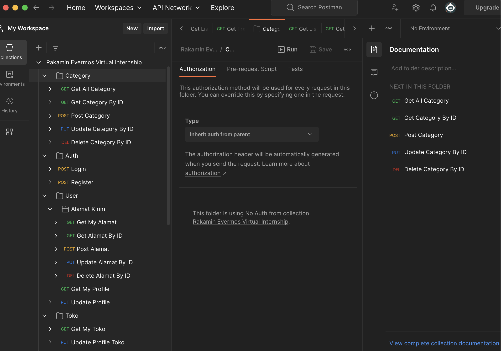
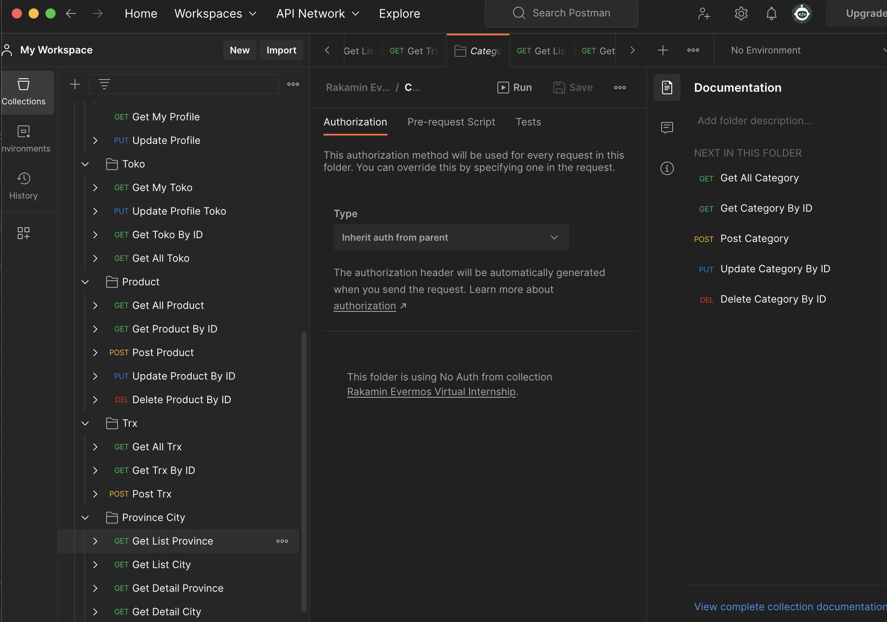
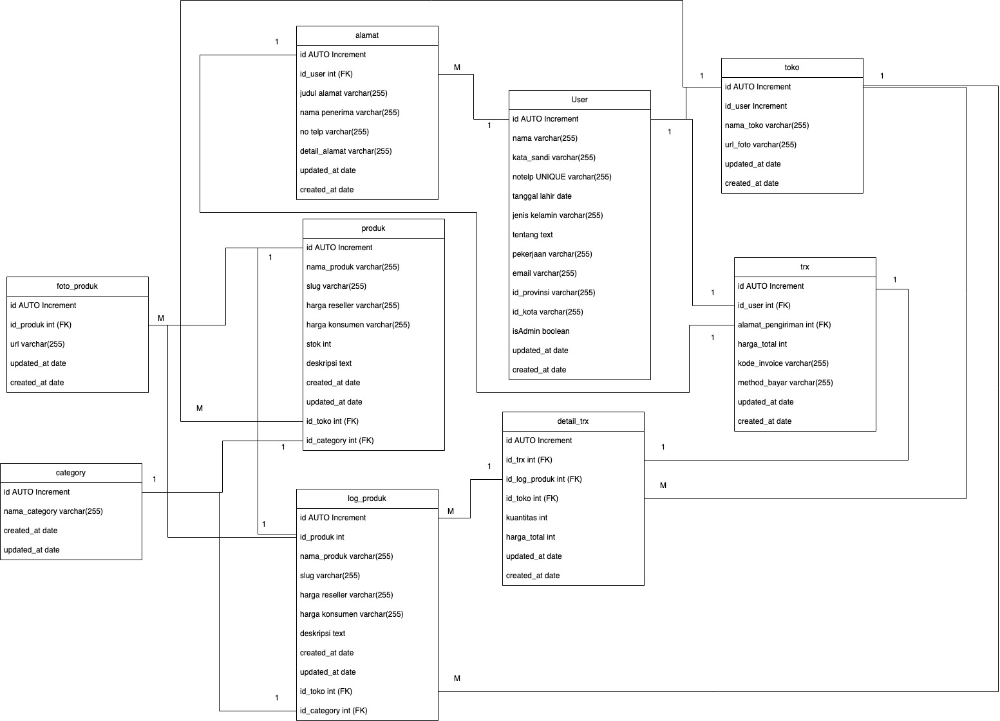

# Rakamin VIX - Evermos Backend Developer Virtual Internship Program

## Description

This repository contains my solution for the final assignment of the [Rakamin VIX - Evermos Backend Developer Virtual Internship Program](https://www.rakamin.com/virtual-internship-experience/back-end-developer-evermos).

### Task Conditions

The conditions required to complete the task. 
1. Having a routing table complying with the following postman collection. 
[[See the collection]](https://github.com/lareza-farhan-wanaghi/rakamin-vix-evermos-backend-developer/blob/master/Rakamin%20Evermos%20Virtual%20Internship.postman_collection.json)
2. Can have more APIs than the ones listed above but not less.
3. The "email" dan "no telepon" columns of the User table must be unique.
4. Using JWT for the authentication.
5. Having an API(s) uploading a file(s).
6. When creating User data, create also its Toko data automatically.
7. Alamat data is needed when creating Trx data.
8. The Category table should only be modified by admin users.
9. Implementing data pagination.
10. Implementing data filtering.
11. Users should not be able to retrieve or modify other users' User data.
12. Users should not be able to modify other users' Alamat data.
13. Users should not be able to modify other users' Toko data.
14. Users should not be able to modify other users' Produk data.
15. Users should not be able to modify other users' Trx data.
16. When creating Trx data, create also its LogProduk data.
17. The LogProduk table should be used to store Produk data associated with Trx data.
18. Implementing clean architecture.

### Additional Resources

Additional resources to illustrate more about the app contained in this repository.

- The below images are the sample appearances when importing the Postman collection.
  

  

  

- The below image is the database design made by the assignor.
  

### Conclusion
To conclude, the internship program has taught me a lot of things related to backend development, including creating REST APIs, managing a database and its transactions, handling authentication, setting up a development work environment, and above all, writing codes doing all these things cleanly. Additionally, through this final assignment, it also has given me an idea of what backend engineer work looks like. In my opinion, the program, especially the final assignment, has been designed quite well and is a great resource to enrich insight related to backend development.